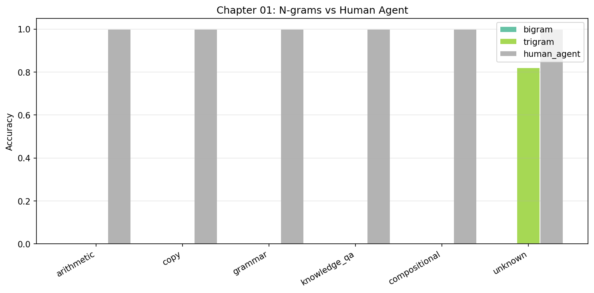

# Chapter 01: N-gram Language Models

## Goal

Build the simplest possible language model — one that predicts the next character by counting how often characters appear together. No neural network, no gradients, just statistics.

## The Running Example

Every chapter in this book tests the same three benchmark prompts. They are designed to probe three distinct capabilities: computation, retrieval, and abstention. Here we trace all three through a bigram and a trigram model to see exactly where counting-based models break.

### Prompt 1: `"ADD 5 3 ="` -- expected `"8"` (computation)

**Bigram**: The model looks at only the last character, `=`. During training, `=` was followed by digits 0-9 with various frequencies depending on the arithmetic results in the corpus. Suppose the training distribution looks like:

- P("1" | "=") = 0.12
- P("5" | "=") = 0.11
- P("8" | "=") = 0.10
- P("9" | "=") = 0.10
- P("0" | "=") = 0.09
- ... other digits fill the rest

The model picks the most common digit after `=`, say `"1"`. That is wrong. It never sees the `5` or the `3` — those are 4 and 6 characters back, completely outside the 1-character window.

**Trigram**: The model looks at the last two characters, `" ="` (space then equals). In training, `" ="` was followed by the same spread of digits — the space before `=` carries no information about which operands appeared earlier. The trigram might pick `"9"`. Still wrong. The operands `5` and `3` are 4+ characters back, outside the 2-character window.

### Prompt 2: `"FACT: paris is capital of france. Q: capital of france?"` -- expected `"paris"` (retrieval)

**Bigram**: The model looks at only the last character, `?`. In training, `?` was most commonly followed by a space or newline — it is a sentence-ending character. The model generates `" "`, then from `" "` generates the most common character after a space (perhaps `"t"`), then from `"t"` generates `"h"`, and so on. It produces common English fragments, nothing resembling `"paris"`. The answer is more than 40 characters back in the prompt — utterly unreachable.

**Trigram**: The model looks at `"e?"` (the last two characters of `"france?"`). In training, `"e?"` might have been followed by various characters. Perhaps it generates `"p"` by coincidence, but the next step would look at `"?p"` and produce something unrelated. There is no mechanism to locate the word `"paris"` from the fact stated earlier in the prompt. The relevant context is dozens of characters away.

### Prompt 3: `"Q: What is the capital of the Moon?"` -- expected `"unknown"` (hallucination/abstention)

**Bigram**: Same mechanics as Prompt 2 — the model sees `?` and generates whatever character most commonly follows `?` in training. It outputs `" "`, then `"t"`, then `"h"`, then `"e"` — producing common English patterns. It has no concept of "this question is unanswerable." It will always generate something.

**Trigram**: The model sees `"n?"` (from `"Moon?"`). It generates common continuations. Perhaps `" "`, then `"th"`, then `"e"`. Again, common English fragments. There is zero mechanism for abstention. N-gram models always produce output — they cannot represent uncertainty about whether an answer exists.

This is a 100% hallucination rate. Every unanswerable question gets a confident-looking (but meaningless) response.

### Summary Table

```
| Prompt                       | Ch01 Bigram | Ch01 Trigram | Correct   | What changed                         |
|------------------------------|-------------|--------------|-----------|--------------------------------------|
| ADD 5 3 =                    | "1"         | "9"          | "8"       | Wrong -- can't see operands          |
| FACT: paris... Q: capital?   | " "         | "p"          | "paris"   | Wrong -- context too far back        |
| Q: capital of Moon?          | "the"       | "the"        | "unknown" | Hallucination -- always generates    |
```

Three prompts, three failures, three different reasons. The rest of this chapter explains the mechanics behind those failures.

## How N-grams Work

A **language model** assigns a probability to the next token given the previous tokens. N-grams do this by counting co-occurrences in training data.

### Bigram Model

A bigram predicts the next token based on **only the previous token**.

$$
P(c_t \mid c_{t-1}) = \frac{\text{count}(c_{t-1}, c_t)}{\text{count}(c_{t-1})}
$$

This is exactly what happened with our three benchmark prompts. For Prompt 1, the model computes P(next | `=`) by counting how often each character followed `=` in training. For Prompts 2 and 3, it computes P(next | `?`). In both cases, the single previous character carries almost no information about the correct answer.

**Generation**: Start with a prompt, then repeatedly pick the most likely next character:

```
Prompt: "ADD 5 3 ="
Step 1: After "=" -> most common next char from training (e.g., "1")
Step 2: After "1" -> most common next char (e.g., "9")
...
```

The problem: the model only sees **one character back**. For `"ADD 5 3 ="`, the digits `5` and `3` are invisible. For the retrieval prompt, the word `"paris"` is invisible. For the Moon prompt, the concept of "unanswerable" does not exist.

### Trigram Model

A trigram uses the **previous two tokens** as context.

$$
P(c_t \mid c_{t-2}, c_{t-1}) = \frac{\text{count}(c_{t-2}, c_{t-1}, c_t)}{\text{count}(c_{t-2}, c_{t-1})}
$$

Two characters of context helps with local patterns — for instance, the trigram can learn that after `"=8"` the sequence should end, or that after `"D "` a digit is expected. But for our benchmark prompts, the extra character of context changes nothing fundamental. The pair `" ="` still cannot see the operands in Prompt 1. The pair `"e?"` still cannot reach `"paris"` in Prompt 2. The pair `"n?"` still cannot recognize that Prompt 3 is unanswerable.

### Fallback (Backoff)

When the trigram encounters a pair it hasn't seen before, it **falls back** to the bigram:

$$
P(c_t \mid c_{t-2}, c_{t-1}) =
\begin{cases}
\frac{\text{count}(c_{t-2}, c_{t-1}, c_t)}{\text{count}(c_{t-2}, c_{t-1})} & \text{if pair seen} \\[6pt]
P(c_t \mid c_{t-1}) & \text{otherwise (bigram fallback)}
\end{cases}
$$

Suppose during generation of Prompt 2's answer, the model encounters a character pair it has never seen in training. It falls back to the bigram, which knows even less. Backoff prevents the model from getting stuck on unseen contexts, but it provides strictly less information — falling back from "can't solve the task" to "really can't solve the task."

## Step-by-Step: What Happens During Training

1. **Collect training data**: generate prompt+answer pairs from all tasks
   - `"ADD 5 3 =8"`, `"FACT: paris is capital of france. Q: capital of france?paris"`, etc.

2. **Fit the tokenizer**: map each character to an integer ID
   - `'A'->4, 'D'->5, ' '->6, '5'->7, ...`

3. **Count co-occurrences**: for every consecutive pair (bigram) or triple (trigram), increment a counter
   - Bigram: `counts[prev_char][next_char] += 1`
   - Trigram: `counts[(prev2, prev1)][next_char] += 1`

4. **That's it** — no optimization loop, no loss function, no gradients.

## Why N-grams Fail on Our Tasks

The three benchmark prompts expose the three core failure modes. The table below connects each task category to the specific bottleneck:

| Task | Why It Fails | Running Example |
|------|-------------|-----------------|
| **Arithmetic** | After `=`, the model picks the globally most common digit — it doesn't know what `5 + 3` equals | Prompt 1: bigram sees `=`, picks `"1"` instead of `"8"` |
| **Retrieval / Knowledge QA** | After `?`, it outputs common characters, not the specific fact from context | Prompt 2: `"paris"` is 40+ characters back, unreachable |
| **Hallucination / Abstention** | Always generates something — no mechanism to abstain or signal uncertainty | Prompt 3: outputs `"the"` instead of `"unknown"` |
| **Copy** | After the delimiter, it generates the most common character, not the specific sequence to copy | Same as retrieval — the content to copy is outside the window |
| **Grammar** | Can predict common bracket pairs locally (`()`) but can't track nesting depth | Would need a stack or counter |
| **Compositional** | Can't chain operations — no intermediate state tracking | Would need working memory |

The fundamental problem: **n-grams have a fixed, tiny context window** (1-2 characters). Every task requires understanding that spans the full prompt.

## Human Lens

A human given `"ADD 5 3 ="` parses the operation, holds the numbers `5` and `3` in working memory, applies the addition algorithm, and writes `"8"`. A human given `"FACT: paris is capital of france. Q: capital of france?"` scans the fact, locates `"paris"`, and retrieves it. A human given `"Q: What is the capital of the Moon?"` recognizes that the question is unanswerable — the Moon has no capital — and says `"unknown"`.

N-grams can do none of this. They cannot parse structure, hold intermediate results, apply learned algorithms, attend to distant context, or recognize when a question has no answer. The gap between 0-14% accuracy (n-grams) and 100% (human) reflects the complete absence of understanding, memory, and reasoning.

## What to Observe When Running

Run `python chapters/01_ngrams/run.py` and notice:

1. **Bigram gets ~0%** — one character of context is useless
2. **Trigram gets ~14%** — two characters help slightly (e.g., guessing common bracket patterns)
3. **100% hallucination** for both — they always generate something, even for unanswerable questions
4. **0% abstention** — n-grams have no concept of "I don't know"
5. Look at the **sample generations** — they drift into repetitive patterns quickly

### Generated Plot

After running, check `results/ch01_comparison.png`:



This chart shows accuracy per task for bigram, trigram, and human agent. The n-gram bars are nearly flat at zero across all tasks, with the trigram showing a small bump on grammar (it can guess common bracket patterns by chance). The human agent towers at 100% on every task. The massive gap visualizes what's missing: understanding, memory, and reasoning — none of which counting co-occurrences can provide.

## What's Next

In **Chapter 02 (Feed-Forward LM)**, we replace counting with a neural network. A fixed-window MLP can learn more complex patterns within its window — but it is still limited by having no way to handle variable-length dependencies. The three benchmark prompts carry forward: we will trace `"ADD 5 3 ="`, the retrieval prompt, and the Moon question through every architecture in this book, watching each one get closer to (or further from) the correct answers.
